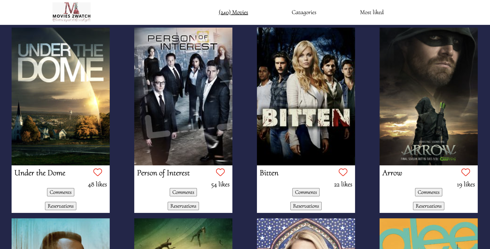
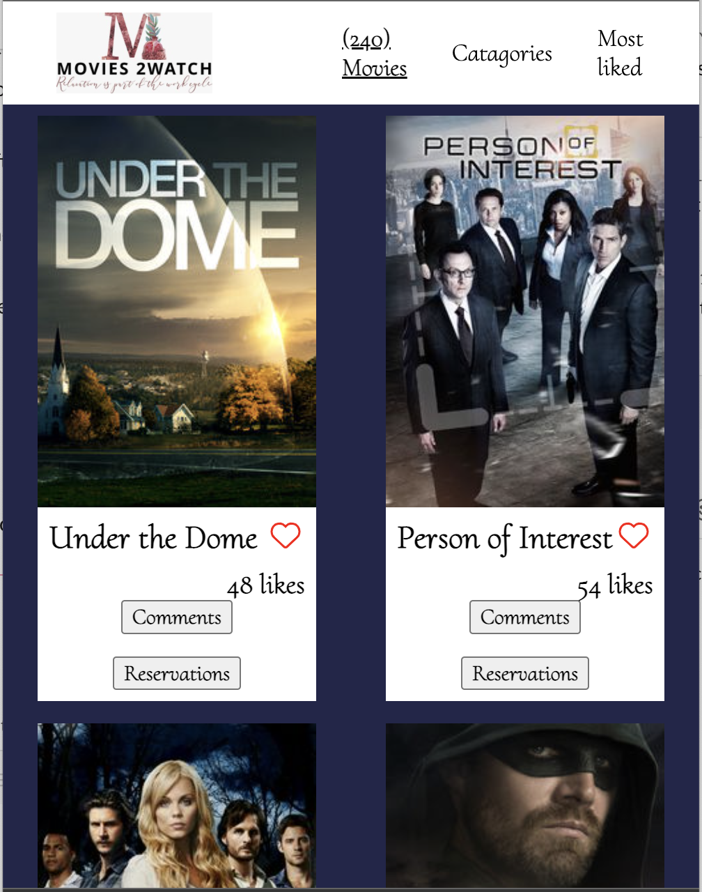
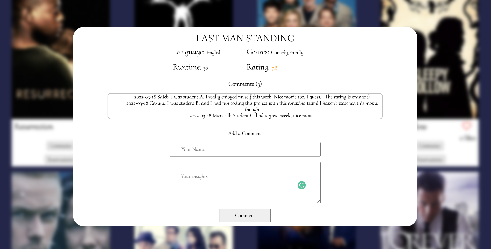

# MOVIES-2WATCH

> This `CAPSTONE PROJECT` is to attest that the members of this team of authors have completed the second module of the Microverse curriculum called, ***JavaScript and Networking***.
We built a movie app sends and receives data to and from not just one, but two APIs to display a large array of tv shows and allow for engagements: likes, comments and reservations for each and every show. It also displays indepth information about each show, alongside a rating to make it easy for anyone who is looking for a great show to relax on. Check it out, and support us with a star if you like it. Demo screenshots are shown below:

## Built With

- Javascript, HTML, CSS
- npm webpack, linters
- Jest

## Live Demo

Click [this link]() to open the application in your browser.

## Getting Started

To get a local copy up and running follow these simple example steps.

### Prerequisites

You will need:

A laptop or tablet, preferably a laptop;
A browser installed like Chrome, Firefox, etc;
A text editor like installed Atom, VS-code, etc;
Terminal or commandline;
Internet connection.

### Setup, Install, and Usage

Proceed to follow these steps:

- Create a folder in the local storage of your computer which will contain the repository;
- open your browser and go to [the project's repository on github](https://github.com/saied2035/movie-app);
- Click on the `code button` and copy the https link that is provided on the dropdown;
- open terminal or commandline from the folder you created in the first step, and type in the command, "git clone " and then paste the url you copied on the previous step, (https://github.com/saied2035/movie-app.git).
- finally, you have the repository on your local computer storage. You can now open your text editor and import the repository to start making changes.
- run `npm install` in the project directory to install node_modules and other dependencies.
- also run `npm run start` to start the app
- Now you're good to go.

## Authors

👤 **Chia Carlyle**

- GitHub: [@carlylechia](https://github.com/carlylechia)
- LinkedIn: [Chia Carlyle](https://linkedin.com/in/chia-carlyle)

👤 **Maxwell Appiah**

- Github: [@i-max-xi](https://github.com/i-max-xi)

👤 **Saieb Gaffer**

- Github: [@Saieb2035](https://github.com/saied2035)

## 🤝 Contributing

Contributions, issues, and feature requests are welcome!

Feel free to check the [issues page](https://github.com/saied2035/movie-app/issues).

## Show your support

Give a ⭐️ if you like this project!

## Acknowledgments

- Hat tip to the Microverse team for the guidance and reviews.

## 📝 License

This project is [MIT](./MIT.md) licensed.
